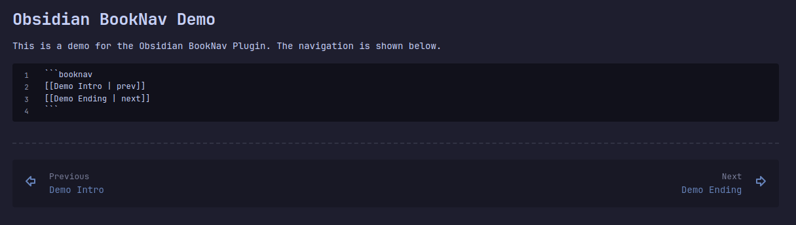

# Obsidian BookNav Plugin

This is a plugin to create clickable internal or external links in a note (usually at the bottom) to guide a reader along an intended path. There are no dependencies on any other plugins. If the note is viewed in another application, it will be shown as a code block.



## Usage

Add a code block with the language "booknav". Each line of the code block will be parsed as a link. Styling can be applied to each link if "alt" text is provided.

~~~
```booknav
  [[Page One | prev]]
  [[Page Three | next]]
```
~~~

This will generate a full-width element on the note where the codeblock is placed. All links will be parsed and resolved to internal/external links. If the links are internal, the hover action will show the page preview.

## Styling

The default CSS included with the plugin uses color variables from the Obsidian namespace, so it should match the existing theme. You can customize the styling by adding a snippet and changing the following classes.

| Class | Description |
| --- | --- |
| .block-language-booknav | The containing element |
| .booknav p | The button container |
| .booknav a | Links inside the navigation element |
| .booknav a.prev | The link marked with the `prev` alt text |
| .booknav a.next | The link marked with the `next` alt text |
| .booknav a.prev::before | Pseudo-element that contains the word "Previous" |
| .booknav a.next::before | Pseudo-element that contains the work "Next" |
| .booknav a.center | Link marked with the `center` alt text |
| .booknav a:hover | The styling when any link in the navigation is hovered |

It may be necessary to mark the styling in your snippet with `!important` to take hold.

